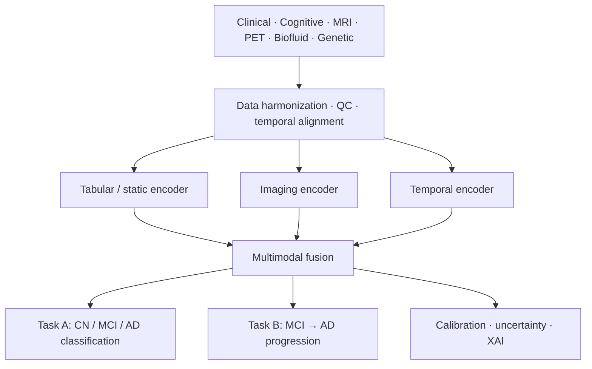

# NeuroFusion-AI

**Explainable Multimodal Machine Learning for Alzheimer's Disease Classification and Longitudinal Progression Prediction Using ADNI**

*Master's-level research and software engineering project · Python · Clinical & cognitive data · MRI/PET · Biomarkers · Genetics · Temporal ML · Explainable AI*

> **Research use only.** Outputs are probabilistic model estimates, not clinical diagnoses or treatment advice. This is a research platform, not a diagnostic device.

## Documentation hub

This project documentation is split into focused pages so it is easier to navigate on GitHub.

- [Documentation home](./docs/README.md)
- [Overview](./docs/overview/README.md)
- [Data & cohort](./docs/data/README.md)
- [Methods](./docs/methods/README.md)
- [Evaluation & trustworthiness](./docs/evaluation/README.md)
- [Implementation & roadmap](./docs/project/README.md)

---

## Table of contents

1. [Overview](#1-overview)
2. [Research question and hypotheses](#2-research-question-and-hypotheses)
3. [Prediction tasks](#3-prediction-tasks)
4. [Data: ADNI](#4-data-adni)
5. [System architecture](#5-system-architecture)
6. [Methods](#6-methods)
7. [Evaluation framework](#7-evaluation-framework)
8. [Leakage prevention and reproducibility](#8-leakage-prevention-and-reproducibility)
9. [Experimental programme](#9-experimental-programme)
10. [Implementation status](#10-implementation-status)
11. [Project structure](#11-project-structure)
12. [Quick start](#12-quick-start)
13. [Roadmap](#13-roadmap)
14. [Deliverables and success criteria](#14-deliverables-and-success-criteria)
15. [Governance, ethics and limitations](#15-governance-ethics-and-limitations)
16. [References](#16-references)

---

## 1. Overview

Alzheimer's disease research increasingly depends on combining heterogeneous evidence rather than interpreting one measurement in isolation. NeuroFusion-AI is a Python research platform that integrates **clinical, cognitive, neuroimaging (MRI/PET), biofluid biomarker and genetic** information from the Alzheimer's Disease Neuroimaging Initiative (ADNI) into unified predictive models.

The project is not defined by a single classifier. Its contribution is an integrated, reproducible study of:

- heterogeneous patient representation,
- multimodal fusion,
- temporal (longitudinal) prediction,
- missing-modality robustness,
- trustworthy AI: calibration, uncertainty, explainability and subgroup analysis.



The architecture deliberately separates data engineering from modelling: cohort definition, temporal alignment, quality control and leakage prevention are first-class research components, not preprocessing details.

---

## 2. Research question and hypotheses

> Can multimodal machine learning that integrates heterogeneous and longitudinal ADNI information improve Alzheimer's disease-state classification and MCI-to-AD progression prediction compared with single-modality and conventional baseline models, while remaining calibrated, interpretable and robust to missing modalities?

| ID | Hypothesis |
|---|---|
| **H1 — Fusion** | Multimodal models give stronger out-of-sample discrimination and/or calibration than the best single-modality model. |
| **H2 — Time** | Longitudinal representations add predictive information beyond baseline-only representations. |
| **H3 — Architecture** | Learned hybrid fusion is competitive with or superior to simple concatenation and fixed late fusion. |
| **H4 — Robustness** | Explicit missing-modality handling and uncertainty estimation improve robustness when diagnostic modalities are unavailable. |

---

## 3. Prediction tasks

| | **Task A — Current state** | **Task B — Future progression** |
|---|---|---|
| Question | What is the participant's current diagnostic state? | Will a participant with MCI convert to AD within horizon *H*? |
| Formulation | X<sub>t</sub> → {CN, MCI, AD} | X<sub>≤t₀</sub> → P(MCI → AD within *H* months) |
| Population | Eligible ADNI participants at a defined visit | Participants with MCI at index time t₀ |
| Output | Probability distribution P(CN), P(MCI), P(AD) | Probability of conversion within *H* |
| Horizons | — | 12 / 24 / 36 months, chosen only after checking follow-up coverage and class counts |
| Primary metrics | Macro-F1, class sensitivity, one-vs-rest AUROC | AUROC, AUPRC, sensitivity, specificity |
| Secondary | Confusion matrix, calibration | Brier score, calibration, PPV/NPV |

**Definitions.** CN = cognitively normal · MCI = mild cognitive impairment · AD = Alzheimer's disease/dementia, according to the diagnostic rules of the relevant ADNI phase.

**Leakage-safe temporal design (Task B).** All predictors must satisfy `t_feature ≤ t₀`; the outcome is observed strictly afterwards (`t_outcome > t₀`). The software must reject any feature whose timestamp violates the experiment's prediction cut-off.

Both tasks return **probabilities, not just labels**, which enables calibration, uncertainty analysis and ensembling.

---

## 4. Data: ADNI

The primary dataset is [ADNI](https://adni.loni.usc.edu/), a longitudinal, multi-centre observational study providing clinical/cognitive assessments, MRI and PET imaging, biofluid biomarkers, genetic/omics data and demographics to approved researchers.

### Access model

ADNI files are **provided manually** and never fetched by this software:

```
manual download  →  place in data/raw/  →  register manifest  →  run pipeline
```

No IDA API, no web scraping, no automated authentication, no automated downloading. Record file name, ADNI phase/release, download date, processing version and dictionary used. From that point onward the pipeline must be reproducible.

### Modalities

| Modality | Representative information | Modelling role |
|---|---|---|
| Clinical | Diagnosis, medical history, function, neurological/physical assessments | Tabular + longitudinal |
| Cognitive | ADAS-Cog, CDR, MMSE, MoCA, AVLT, FAQ | Trajectory modelling |
| MRI | Processed regional measures (raw images optional) | Numeric biomarkers / imaging |
| PET | FDG, amyloid, tau where available | Molecular imaging |
| Biofluid | Blood/CSF biomarkers | Tabular biomarker encoder |
| Genetic | APOE (ε4 allele count 0/1/2), selected omics | Static / high-dimensional encoder |

The core project starts with **standardized numerical features and processed imaging summaries**. Direct 3D MRI/PET learning is an advanced extension.

### Core data model

A **participant × visit** longitudinal table:

| RID | VISCODE | EXAMDATE | DX | MMSE | ADAS13 | CDRSB | MRI | PET | CSF | APOE |
|---|---|---|---|---|---|---|---|---|---|---|
| 001 | bl | … | CN | 29 | 8 | 0 | ✓ | – | – | 0 |
| 001 | m12 | … | MCI | 26 | 14 | 1.5 | ✓ | ✓ | – | 0 |
| 001 | m24 | … | MCI | 24 | 19 | 3 | ✓ | ✓ | ✓ | 0 |
| 001 | m36 | … | AD | 20 | 28 | 6 | ✓ | ✓ | ✓ | 0 |

Join on participant **and** visit/time information; `RID` alone is not enough for longitudinal alignment. Exact variables and joins must be documented from the approved ADNI release you use.

### Data rules

1. Never manually edit files in `data/raw/`; treat them as immutable evidence.
2. Every processed dataset must be reproducible from code + configuration.
3. Track table/file version, download date, variable dictionary and processing provenance.
4. Keep identifiers only in the approved controlled research environment.
5. Never commit raw ADNI data to public version control.

---

## 5. System architecture

| Layer | Responsibility |
|---|---|
| Data governance | ADNI access, provenance, dictionaries, version tracking |
| Harmonization | Visit alignment, coding normalization, QC, missingness metadata |
| Representation | Static/tabular, imaging and temporal encoders |
| Fusion | Early, late and learned hybrid multimodal fusion |
| Prediction | CN/MCI/AD classification and MCI→AD progression |
| Trustworthiness | Calibration, uncertainty, XAI, subgroup and stress testing |
| Research interface | Experiment registry, prediction ledger, dashboard |

### Planned software modules

ADNI Data Manager · Cohort Builder · Patient Timeline Engine · Clinical/Cognitive Engines · MRI/PET Engines · Biomarker/Genetic Engines · Missing Data Engine · Fusion Engine · Base Learner Engine · Ensemble & Progression Engine · Calibration/Uncertainty · Explainable AI Engine · Experiment Manager · Dashboard.

---

## 6. Methods

### 6.1 Base learners (Task A and Task B)

All five are trained under the same participant-level split and preprocessing protocol, and all output probabilities.

| ID | Model | Purpose |
|---|---|---|
| M1 | Logistic Regression (multinomial) | Transparent linear baseline; calibration reference |
| M2 | SVM (RBF) | Nonlinear margin classifier; probabilities calibrated before combination |
| M3 | Random Forest | Bagged trees; robust tabular baseline |
| M4 | XGBoost / LightGBM | Gradient-boosted trees; high-performance tabular benchmark |
| M5 | MLP | Neural tabular representation |

### 6.2 Ensembles

| | Strategy | Definition |
|---|---|---|
| **A** | Soft voting | Mean of the five probability vectors |
| **B** | Weighted soft voting | P<sub>e</sub>(c\|X) = Σ<sub>m</sub> w<sub>m</sub> P<sub>m</sub>(c\|X), w<sub>m</sub> ≥ 0, Σ w<sub>m</sub> = 1; weights derived on **validation data only** |
| **C** | Stacking | Z = [P<sub>LR</sub>, P<sub>SVM</sub>, P<sub>RF</sub>, P<sub>XGB</sub>, P<sub>MLP</sub>] → logistic-regression meta-learner trained on **out-of-fold** predictions; base learners then refit on the permitted training data |

**5 individual models + 3 ensembles = 8 predictive configurations**, compared on identical held-out participants. The test set is never used to choose base models, weights or the meta-model.

### 6.3 Multimodal fusion

- **Early fusion:** concatenate modality features, then ŷ = f<sub>θ</sub>(Z<sub>early</sub>).
- **Late fusion:** P(Y=c\|X) = Σ<sub>m</sub> w<sub>m</sub> P<sub>m</sub>(Y=c\|X<sub>m</sub>), w<sub>m</sub> ≥ 0, Σ w<sub>m</sub> = 1.
- **Learned hybrid fusion:** per-modality encoders h<sub>m</sub> = f<sub>m</sub>(X<sub>m</sub>), attention α<sub>m</sub> = softmax(e<sub>m</sub>), h<sub>fusion</sub> = Σ α<sub>m</sub> h<sub>m</sub>.

Attention weights may characterize how the model combines modalities but **must not be presented as causal explanations**.

### 6.4 Longitudinal modelling

A participant history is an ordered sequence 𝒳<sub>p</sub> = {x<sub>t₁</sub>, …, x<sub>tₙ</sub>}. Baseline-only prediction ŷ = f(X<sub>t₀</sub>) is compared with temporal models (GRU, LSTM and, if data volume supports it, Transformer-style encoders). Trajectory features include change ΔC, velocity v<sub>C</sub> = (C(t₂) − C(t₁)) / (t₂ − t₁) and quadratic fits, computed **only** from observations inside the permitted feature window.

### 6.5 Missing data and missing modalities

Feature-level missingness is distinguished from complete modality absence. Candidate methods: median/robust imputation, iterative imputation, missingness indicators, modality masks, modality dropout during training, and mixture-of-experts or attention over available modalities. A simple completeness score is q<sub>p</sub> = (1/M) Σ m<sub>p,m</sub>, where **M**<sub>p</sub> is the modality-availability vector.

### 6.6 Preprocessing

- Standardization with **training-set statistics only**: z = (x − μ) / σ.
- MRI ROI volumes normalized by intracranial volume: V<sub>norm</sub> = V<sub>ROI</sub> / V<sub>ICV</sub>.
- PET SUVR = target-ROI uptake / reference-region uptake.
- APOE encoded as number of ε4 alleles (0, 1, 2).
- Feature selection fit inside the training fold only; report retained features and selection stability.
- Preserve both transformed values and transformation provenance.

### 6.7 Calibration, uncertainty and explainability

- **Calibration:** Platt scaling, isotonic regression or temperature scaling, fitted on validation data only.
- **Uncertainty:** each prediction carries 𝒫<sub>p</sub> = (ŷ, C, U, Q) (label, confidence, uncertainty, data quality). Confidence must be **explicitly defined and experimentally justified**, not a cosmetic transform of the probability.
- **Explainability:** SHAP for tree models; integrated gradients or modality ablation for neural models. Modality contribution: Δ<sub>m</sub> = Metric<sub>full</sub> − Metric<sub>(−m)</sub>. Explanations describe model contributions, **not biological causation**.

---

## 7. Evaluation framework

Accuracy alone is insufficient. Principal results carry confidence intervals.

| Task | Primary metrics | Secondary analyses |
|---|---|---|
| CN/MCI/AD | Macro-F1; class sensitivity; one-vs-rest AUROC | Confusion matrix; calibration |
| MCI→AD | AUROC; AUPRC; sensitivity; specificity | Brier score; calibration; PPV/NPV |
| Fusion | Δ performance vs best single modality | Paired bootstrap CIs |
| Robustness | Performance under missing modalities | Degradation curves |
| Subgroups | Metrics by prespecified strata | Uncertainty + sample-size reporting |

Bootstrap confidence intervals **resample participants, not rows**. Model comparisons use the same held-out participants whenever possible.

| Metric | Meaning |
|---|---|
| Macro-F1 | F1 averaged over classes, each class weighted equally |
| AUROC | Discrimination across thresholds |
| AUPRC | Precision–recall area; informative under class imbalance |
| Brier score | Mean squared error of predicted probabilities (lower is better) |
| ECE | Expected calibration error: gap between confidence and observed accuracy |

---

## 8. Leakage prevention and reproducibility

Non-negotiable checklist:

- [x] Split at **participant level**; repeated visits/scans never cross partitions.
- [x] Fit imputation and scaling inside training folds only (implemented as pipeline steps).
- [ ] Fit feature selection inside training folds only.
- [ ] Fit calibration on validation data, never the final test set.
- [ ] For progression, enforce timestamp cut-offs programmatically.
- [x] Use the same held-out participants for model comparisons.
- [ ] Persist seeds, cohort query/version, preprocessing parameters and model configuration.
- [ ] Maintain a **prediction ledger** (participant pseudonym, timestamp, model version, modality mask, output probabilities).
- [ ] Report exclusions and cohort attrition transparently (downloaded → eligible → included → excluded, with reasons).

Use nested cross-validation or a fixed train/validation/test design with tuning restricted to training/validation data.

---

## 9. Experimental programme

The thesis answers a small number of explicit questions rather than accumulating algorithms.

| ID | Experiment | Scientific question |
|---|---|---|
| E1 | CN/MCI/AD classification | How accurately can current disease state be classified? |
| E2 | 12/24/36-month progression | Can MCI→AD conversion be forecast prospectively? |
| E3 | Single-modality benchmark | Which modality is most informative alone? |
| E4 | Multimodal fusion | Does fusion improve over the best single modality? |
| E5 | Early vs late vs hybrid | Which fusion architecture is most robust? |
| E6 | Static vs longitudinal | Do trajectories improve prediction? |
| E7 | Classical ML vs DL | Is additional model complexity justified? |
| E8 | Missing modalities | How gracefully does performance degrade? |
| E9 | Calibration | Are estimated risks probabilistically reliable? |
| E10 | Explainability | Which features/modalities drive outputs? |
| E11 | Subgroup analysis | Does performance vary across prespecified groups? |

Main comparison: best individual learner vs the three ensembles on identical held-out participants.

---

## 10. Implementation status

| Component | Status |
|---|---|
| Five base learners (LR, SVM, RF, XGBoost, MLP) | ✅ Implemented |
| Soft voting, weighted voting, stacking (OOF, participant-grouped) | ✅ Implemented |
| Participant-level split with leakage assertion | ✅ Implemented |
| Metrics: macro-F1, OvR AUROC, Brier, ECE | ✅ Implemented |
| Participant-level bootstrap CIs | ✅ Implemented |
| YAML configuration, tests, synthetic-data demo | ✅ Implemented |
| ADNI loader, harmonization, provenance manifest | ⬜ Planned |
| Cohort builder, patient timeline, attrition tables | ⬜ Planned |
| Feature engines (cognitive trajectories, MRI/PET, biomarkers, APOE) | ⬜ Planned |
| Missing-data engine and modality masks | ⬜ Planned |
| Fusion engine (early / late / hybrid attention) | ⬜ Planned |
| Task B progression models; temporal encoders (GRU/LSTM) | ⬜ Planned |
| Calibration and uncertainty module | ⬜ Planned |
| Explainable AI (SHAP, ablation Δ<sub>m</sub>) | ⬜ Planned |
| Nested tuning, experiment registry, prediction ledger | ⬜ Planned |
| Research dashboard (Plotly/Dash) | ⬜ Planned |

The demo currently runs on **synthetic data**; scores it prints demonstrate that the code runs and carry no scientific meaning.

---

## 11. Project structure

```
NeuroFusion-AI/
├── configs/
│   └── task_a.yaml               # seed, split sizes, bootstrap settings
├── data/
│   ├── raw/                      # manually downloaded ADNI files (immutable, git-ignored)
│   │   ├── demographics/  diagnosis/  cognitive/  clinical/
│   │   └── genetics/  biofluid/  mri_numeric/  pet_numeric/
│   ├── dictionaries/             # ADNI data dictionaries
│   ├── interim/                  # intermediate tables
│   └── processed/                # analysis-ready datasets
├── src/
│   ├── data_import/              # loaders / harmonization (synthetic loader for now)
│   ├── models/                   # M1–M5, one file each, plus registry
│   │   ├── preprocessing.py  logistic.py  svm.py
│   │   └── random_forest.py  xgboost_model.py  mlp.py
│   ├── ensembles/                # base.py, soft_voting.py, weighted_voting.py, stacking.py
│   └── experiments/              # splits.py, metrics.py, bootstrap.py
├── experiments/
│   └── run_task_a.py             # runnable experiment scripts
├── models/                       # saved model artifacts
├── reports/                      # outputs and exportable reports
├── notebooks/                    # exploration
├── tests/                        # leakage and ensemble tests
├── requirements.txt
└── .gitignore
```

Planned additions: `src/cohort/`, `src/timeline/`, `src/features/`, `src/missing/`, `src/fusion/`, `src/progression/`, `src/calibration/`, `src/xai/`, `src/dashboard/`.

Note: top-level `models/` holds saved artifacts; `src/models/` holds the code that defines them. Likewise, `experiments/` holds runnable scripts and `src/experiments/` holds reusable code.

---

## 12. Quick start

```bash
# 1. Environment
python -m venv .venv && source .venv/bin/activate
pip install -r requirements.txt

# 2. Run the Task A demo (synthetic data)
python -m experiments.run_task_a

# 3. Run tests
pytest -q
```

Run experiments from the project root with `python -m …` so that `src` imports resolve.

### Using real ADNI data

1. Download your approved ADNI tables manually and place them under `data/raw/<modality>/`; put the data dictionary in `data/dictionaries/`.
2. Record file, phase/release, download date, processing version and checksum in a local provenance manifest.
3. Add a loader in `src/data_import/` that returns `X` (features), `y` (integer labels: CN=0, MCI=1, AD=2) and `groups` (participant `RID`).
4. Swap the `make_synthetic(...)` call in `experiments/run_task_a.py` for your loader.
5. Always keep splits and stacking folds grouped by participant.

### Adding a model or ensemble

Create one file in `src/models/` or `src/ensembles/` exposing `fit` / `predict_proba`, then register it in that package's `__init__.py`.

---

## 13. Roadmap

| Phase | Focus | Exit criterion |
|---|---|---|
| 0 | Setup and governance | A fresh clone builds the environment; local ADNI files are discoverable via config; raw data are not committed |
| 1 | Cohort construction | **D1:** variables, inclusion/exclusion rules, labels, horizons, provenance; attrition tables; modality-availability flags |
| 2 | Five base learners | Same participant-level split and preprocessing for all; probabilities out |
| 3 | Multimodal feature space | Add modalities stepwise (clinical+cognitive → APOE → biofluid → MRI → PET), recording sample size, missingness, class balance and performance at each step; expand only while the cohort supports a defensible experiment |
| 4 | Ensemble methodology | Soft, weighted and stacking compared on identical held-out participants |
| 5 | MCI→AD progression | Base learners and ensembles applied to horizon-specific labels |
| 6 | Calibration, uncertainty, XAI | Trustworthiness is part of the experimental programme, not dashboard decoration |
| 7 | Robustness and longitudinal analysis | Missing-modality stress tests, ablations, static vs temporal |
| 8 | Research dashboard | Cohort inspection, trajectories, model comparison, calibration plots, SHAP summaries, forecasts, provenance |

---

## 14. Deliverables and success criteria

| ID | Deliverable |
|---|---|
| D1 | Data & cohort specification |
| D2 | Reproducible Python pipeline |
| D3 | Baseline benchmark (classical ML + single-modality) |
| D4 | Multimodal models (early, late, hybrid fusion) |
| D5 | Longitudinal predictor (MCI→AD at selected horizons) |
| D6 | Trustworthiness suite (calibration, uncertainty, XAI, subgroup, robustness) |
| D7 | Research dashboard |
| D8 | Master's thesis + reproducibility package |

**Success criteria**

- A leakage-safe, documented ADNI cohort can be reconstructed from code and configuration.
- At least four conventional baselines and two multimodal fusion strategies are evaluated (this project targets all five base learners and all three ensembles).
- MCI→AD prediction is evaluated at one or more defensible horizons.
- Calibration and uncertainty are assessed, not merely classification accuracy.
- Missing-modality and modality-ablation experiments are completed.
- Participant-level explanations and model provenance are available in the dashboard.
- Limitations, selection bias and scanner/site heterogeneity are explained, and the system is framed as research support, not a clinical device.

---

## 15. Governance, ethics and limitations

The project uses de-identified research data under ADNI access and use conditions, which must be preserved through storage, processing and publication. The system must not attempt participant re-identification.

| Risk / limitation | Required response |
|---|---|
| Selection bias / research cohort | Describe cohort composition; avoid claims of population-wide clinical validity |
| Missing modalities | Report availability; evaluate robustness explicitly |
| Site/scanner heterogeneity | QC; site/scanner covariates or harmonization where appropriate |
| Temporal leakage | Enforce timestamp cut-offs and participant-level splits |
| Class imbalance | Appropriate metrics; weighting/resampling only inside training |
| Overfitting | Nested tuning, held-out evaluation, confidence intervals |
| Interpretability misuse | Describe associations with model output, not causation |
| Clinical overclaim | Frame as research decision support, not diagnosis or treatment advice |

### Methodological notes

- **Circularity in Task A:** ADNI diagnoses are largely defined by cognitive and functional scores (MMSE, CDR, memory tests). Report results with and without cognitive features so that performance is not just recovery of the labelling rule.
- **Censoring in Task B:** participants without follow-up to the chosen horizon cannot be labelled negative; define inclusion and censoring rules explicitly, and consider time-to-event models as a comparison.
- **Correlated rows:** if every MCI visit becomes a sample, rows are correlated; splits and bootstrap must be at participant level.

---

## 16. References

1. ADNI. *Data and Data Access.* https://adni.loni.usc.edu/data-samples/adni-data/
2. ADNI. *Data Collection documentation.* https://adni.loni.usc.edu/quick-start-guide-asset/datacollection.html
3. ADNI. *Clinical Assessments.* https://adni.loni.usc.edu/data-samples/adni-data/clinicalassessments/
4. ADNI. *About the Study.* https://adni.loni.usc.edu/about/
5. Lundberg, S. M., & Lee, S.-I. (2017). A Unified Approach to Interpreting Model Predictions. *NeurIPS.*
6. Niculescu-Mizil, A., & Caruana, R. (2005). Predicting Good Probabilities With Supervised Learning. *ICML.*
7. Van Calster, B. et al. (2019). Calibration: the Achilles heel of predictive analytics. *BMC Medicine, 17*, 230.

> Exact ADNI files, variables, cohort counts and biomarker definitions must be documented from the approved data release you actually use. Do not hard-code assumptions from older papers or tutorials without checking the current dictionary and release.

## Acknowledgements

Data used in this work were obtained from the Alzheimer's Disease Neuroimaging Initiative (ADNI) database. Use the acknowledgement and publication text required by the ADNI Data Use Agreement in any thesis or paper.
