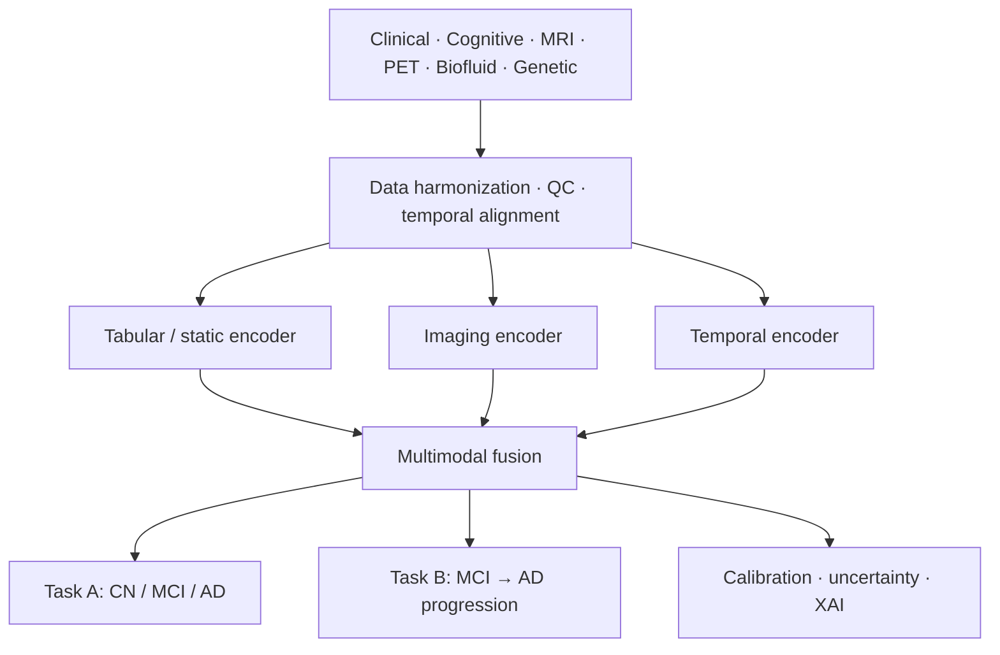

# Overview

## 1. Project vision

NeuroFusion-AI is a Python research platform for multimodal machine learning in Alzheimer's disease classification and longitudinal progression prediction using ADNI data.

The project integrates clinical, cognitive, imaging, biofluid, and genetic information into a single reproducible pipeline.

## 2. Research question

Can multimodal ML improve diagnosis and MCI-to-AD progression prediction while preserving calibration, robustness, and interpretability?

## 3. Primary hypotheses

| ID | Hypothesis |
|---|---|
| H1 | Multimodal models outperform single-modality baselines |
| H2 | Longitudinal representations add predictive signal beyond baseline-only features |
| H3 | Learned hybrid fusion is competitive with or better than fixed late fusion |
| H4 | Missing-modality handling and uncertainty estimation improve robustness |

## 4. Prediction tasks

| Task | Goal |
|---|---|
| Task A | Current state prediction: CN / MCI / AD |
| Task B | Progression prediction: MCI → AD within a defined horizon |

## 5. System architecture

## 6. Planned software modules

- Data governance
- Harmonization
- Representation learning
- Fusion engine
- Prediction engine
- Trustworthiness and explainability
- Experiment registry

## Related pages

- [Data & cohort](../data/README.md)
- [Methods](../methods/README.md)
- [Evaluation & trustworthiness](../evaluation/README.md)
- [Implementation & roadmap](../project/README.md)
